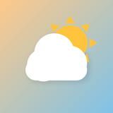
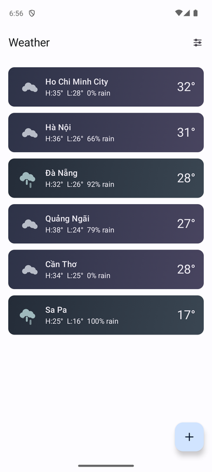
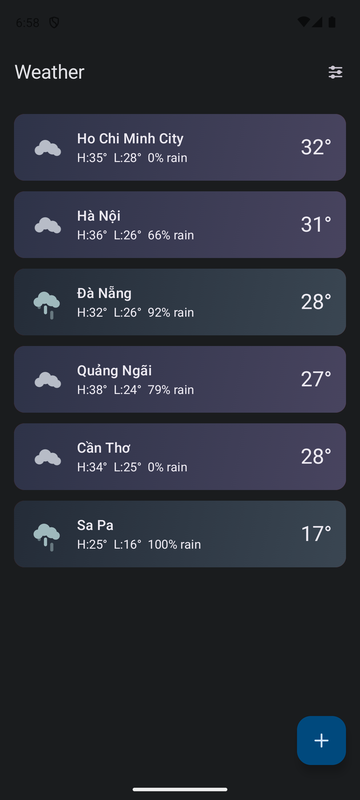
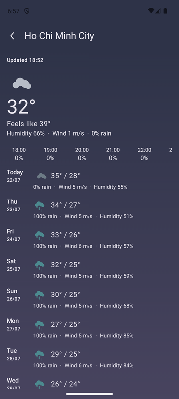
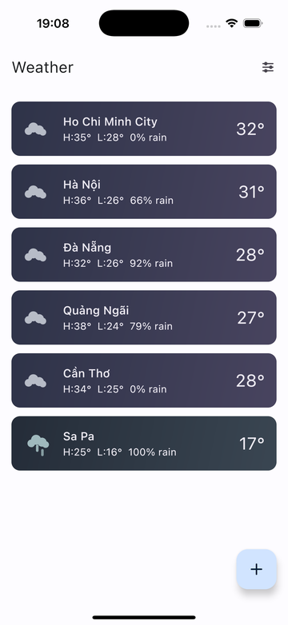
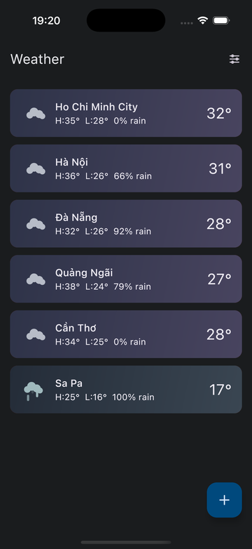
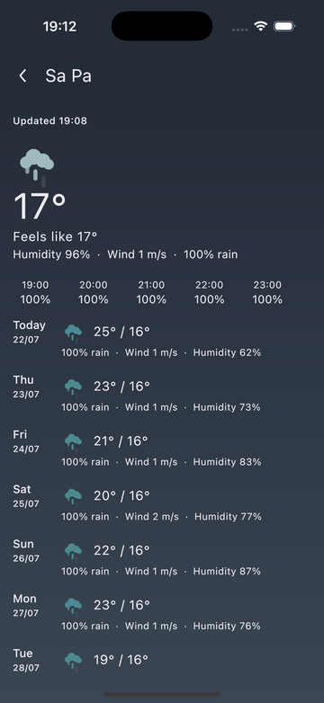
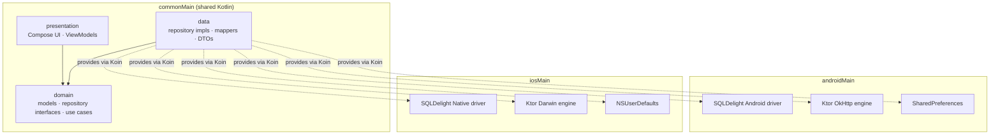

<p align="center">
  
</p>

<h1 align="center">Trời Ơi</h1>

<p align="center">
  A weather app for Android and iOS built with Kotlin Multiplatform and Compose Multiplatform —
  one shared codebase, two native apps.
</p>

<p align="center">
  
  
  
  
  <a href="LICENSE"></a>
</p>

Search for a city, save up to 6 areas, and see current conditions, a 7-day outlook, and an
hourly rain forecast — with offline-first caching, condition-driven gradient theming, a
metric/imperial toggle, and a Light/Dark/System theme switch.

## Screenshots

Live data for six Vietnamese cities — Ho Chi Minh City, Hà Nội, Đà Nẵng, Quảng Ngãi, Cần Thơ,
and Sa Pa — captured on an Android emulator and iOS simulator, in both Light and Dark mode.
The Overview list shows all six saved areas at a glance; the Detail screen's gradient and icon
colors are driven by the viewed area's actual weather condition and time of day, independent of
the app's Light/Dark setting.

<table>
  <tr>
    <th></th>
    <th>Overview — Light</th>
    <th>Overview — Dark</th>
    <th>Detail</th>
  </tr>
  <tr>
    <td><strong>Android</strong></td>
    <td></td>
    <td></td>
    <td></td>
  </tr>
  <tr>
    <td><strong>iOS</strong></td>
    <td></td>
    <td></td>
    <td></td>
  </tr>
</table>

## Features

- **Overview**: saved areas at a glance (current temp, high/low, rain chance), pull-to-refresh,
  swipe-to-delete with undo.
- **Search**: debounced city search backed by OpenWeatherMap's geocoding API, capped at 6 saved
  areas.
- **Detail**: current conditions, an hourly rain strip scoped to the remaining hours of today, and
  a 7-day forecast per area — all set against a soft two-stop gradient keyed to that area's actual
  weather condition and time of day.
- **Animated condition icons**: sun rays rotate, clouds drift, rain/drizzle/snow fall, and storm
  clouds flash — small, cheap Compose property animations, not static glyphs.
- **Theming**: a persisted Light/Dark/System preference, reachable from a Settings screen; picking
  System always wins back over a stale manual choice the next time the OS theme actually changes.
- **Offline-first caching**: SQLDelight is the single source of truth; a 30-minute TTL plus
  request coalescing keep the UI responsive and avoid redundant network calls. Stale cache is
  still shown (flagged) if a refresh fails.
- **Units**: switch between metric (°C, m/s) and imperial (°F, mph); switching invalidates the
  cache and refetches in the new units. Persisted across restarts.
- **Accessible**: all user-facing strings are externalized resources; every screen is
  TalkBack/VoiceOver-navigable with content descriptions on interactive and informational
  elements.

## Tech stack

| Layer | Choice |
| --- | --- |
| UI | Compose Multiplatform, Material 3 |
| DI | Koin |
| Networking | Ktor (OkHttp on Android, Darwin on iOS) |
| Persistence | SQLDelight (Android SQLite driver / iOS native driver) |
| Preferences | multiplatform-settings (SharedPreferences on Android, NSUserDefaults on iOS) |
| Serialization | kotlinx-serialization, kotlinx-datetime |
| Testing | kotlin-test, Turbine, Ktor MockEngine, Compose UI testing (instrumented) |

## Architecture

Clean Architecture with one-way dependencies: `presentation` → `domain` ← `data`. The `domain`
layer (models, repository interfaces, use cases) has no framework imports — it's the one part of
the codebase that doesn't know Android, iOS, Compose, or SQLDelight exist. Everything in
`commonMain` is shared source compiled for both targets; `androidMain`/`iosMain` hold nothing but
the platform bindings each shared interface needs.



## Project layout

- `/composeApp` is the shared Kotlin Multiplatform module.
  - `commonMain` holds the domain, data, and presentation layers shared across both platforms.
  - `androidMain` / `iosMain` hold only the platform-specific bindings (SQL driver, HTTP engine,
    settings storage, Koin platform module).
  - `commonTest` / `androidUnitTest` hold unit tests (ViewModels, repositories, mappers).
    `androidInstrumentedTest` holds Compose UI tests that run on a device/emulator.
- `/iosApp` is the iOS app shell (SwiftUI entry point hosting the shared Compose UI).

## Getting started

Want to clone this and build your own weather app on top of it? Here's the full path from zero
to a running build on both platforms.

1. **Install prerequisites**
   - JDK 17+
   - [Android Studio](https://developer.android.com/studio) (latest stable) with the Kotlin
     Multiplatform plugin
   - Xcode 15+ (macOS only, for the iOS target)
2. **Clone the repo**
   ```bash
   git clone https://github.com/nphkhiem/weather-forecast-by-kmp.git
   cd weather-forecast-by-kmp
   ```
3. **Get an OpenWeatherMap API key.** Sign up at
   [openweathermap.org](https://openweathermap.org/api) and subscribe to the **One Call by Call**
   plan — the free "Current Weather" tier is not enough; One Call 3.0 is what powers both the
   forecast and the geocoding search. It includes 1,000 free calls/day before billing kicks in.
4. **Configure your key locally.** Add this line to `local.properties` at the repo root (this file
   is gitignored — never commit a real key):
   ```properties
   owm.apiKey=YOUR_KEY_HERE
   ```
5. **Run on Android**: open the project in Android Studio and run the `composeApp` configuration,
   or from the command line:
   ```bash
   ./gradlew :composeApp:installDebug
   ```
6. **Run on iOS**: open `iosApp/iosApp.xcodeproj` in Xcode, pick a simulator, and hit Run — or from
   the command line:
   ```bash
   xcodebuild -project iosApp/iosApp.xcodeproj -scheme iosApp -sdk iphonesimulator
   ```
7. **Run the tests**:
   ```bash
   # Unit tests (JVM + iOS simulator)
   ./gradlew :composeApp:testDebugUnitTest :composeApp:iosSimulatorArm64Test

   # Instrumented Compose UI tests (needs a running Android emulator/device)
   ./gradlew :composeApp:connectedDebugAndroidTest
   ```

## License

MIT — see [LICENSE](LICENSE). Fork it, extend it, ship your own version.

---

Learn more about [Kotlin Multiplatform](https://www.jetbrains.com/help/kotlin-multiplatform-dev/get-started.html).
